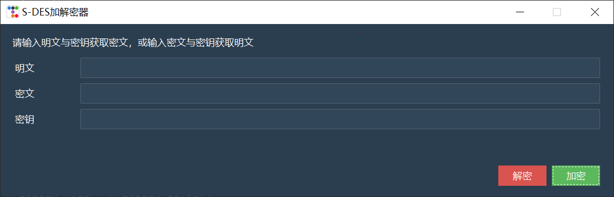
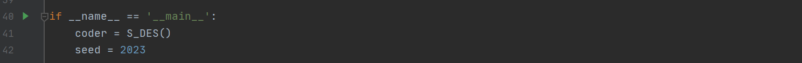

### 作业1：S-DES算法实现(用户指南)

## 文件目录

1. S_DES_123.py        第1，2，3关的执行代码
1. S_DES_45.py          第4， 5关的执行代码

## S_DES_123.py   

 	1. 使用任意支持python的IDE打开该文件
 	2. 执行该文件代码
 	3. GUI界面如下图

#### 加密操作

1. 在明文对应输入框中输入任意明文字符串，可以是**八位二进制字符串**或者**任意长度非中文字符串**
2. 在密钥对应输入框中输入任意密钥字符串，必须是**十位二进制字符串**
3. 点击**加密**按钮即可获得加密结果，并且会将结果复制显示在密文框中

#### 加密操作

1. 在密文对应输入框中输入任意密文字符串，可以是**八位二进制字符串**或者**任意长度非中文字符串**
2. 在密钥对应输入框中输入任意密钥字符串，必须是**十位二进制字符串**
3. 点击**解密**按钮即可获得解密结果，并且会将结果复制显示在明文框中

## S_DES_45.py

 1. 使用任意支持python的IDE打开

 2. 可以通过修改seed来改变随机生成的明密文对

    

 3. 执行该文件代码即可

    